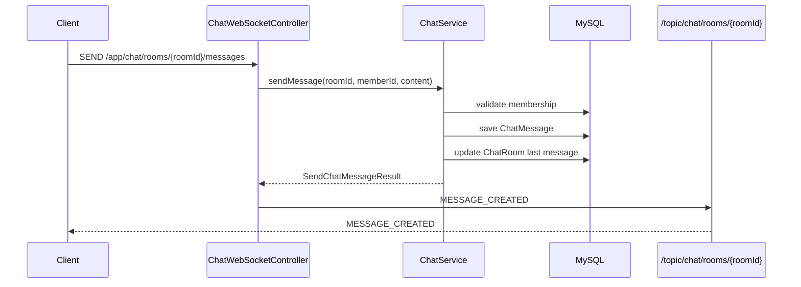
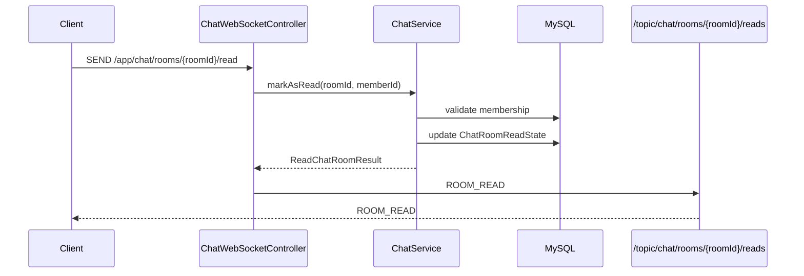

# 04 - WebSocket Chat Structure

## Scope

This work unit adds the first WebSocket-based chat entry point.

```text
CONNECT   /ws
SEND      /app/chat/rooms/{roomId}/messages
SUBSCRIBE /topic/chat/rooms/{roomId}

SEND      /app/chat/rooms/{roomId}/read
SUBSCRIBE /topic/chat/rooms/{roomId}/reads
```

## Core Direction

WebSocket is used only inside the chat room for real-time events.

Business rules stay in `ChatService`.

```text
HTTP Controller
  -> ChatService

WebSocket Controller
  -> ChatService
  -> Broadcast event
```

The WebSocket layer must not call the HTTP API internally.

## Responsibilities

### WebSocketConfig

Responsible for WebSocket/STOMP infrastructure.

```text
- Register endpoint: /ws
- Configure application destination prefix: /app
- Configure broker destination prefix: /topic
- Later: add handshake/authentication interceptor
```

Study points:

```text
- STOMP
- /app vs /topic
- Simple broker vs external broker
- WebSocket handshake
- SockJS: optional, not required for first version
```

### ChatWebSocketController

Responsible for WebSocket entry points.

```text
SEND /app/chat/rooms/{roomId}/messages
  -> ChatService.sendMessage()
  -> Broadcast MESSAGE_CREATED to /topic/chat/rooms/{roomId}

SEND /app/chat/rooms/{roomId}/read
  -> ChatService.markAsRead()
  -> Broadcast ROOM_READ to /topic/chat/rooms/{roomId}/reads
```

This controller should not contain message persistence rules, read cursor rules, or permission rules.

### ChatService

Responsible for chat use cases.

```text
- Validate chat room access
- Save ChatMessage
- Update ChatRoom last message summary
- Query messages
- Update ChatRoomReadState
```

Both HTTP and WebSocket use the same methods.

### DTOs

WebSocket payloads should be separated from HTTP request/response DTOs.

Recommended package:

```text
chat.presentation.websocket.request
chat.presentation.websocket.response
```

Reason:

```text
- HTTP response shape uses ApiResponse
- WebSocket event payload should be event-shaped
- Future event fields can evolve independently
```

## Message Send Flow



## Read Flow



## Payload Draft

### Send Message Request

```json
{
  "memberId": 3,
  "content": "hello"
}
```

### Read Request

```json
{
  "memberId": 3
}
```

### Message Created Event

```json
{
  "type": "MESSAGE_CREATED",
  "roomId": 1,
  "messageId": 10,
  "senderMemberId": 3,
  "content": "hello",
  "createdAt": "2026-08-21T20:00:00"
}
```

### Room Read Event

```json
{
  "type": "ROOM_READ",
  "roomId": 1,
  "memberId": 3,
  "lastReadMessageId": 10,
  "lastReadAt": "2026-08-21T20:00:05"
}
```

## Authentication Plan

The current project still uses temporary `X-Member-Id` for HTTP APIs.

For the first WebSocket version, `memberId` is passed in the WebSocket payload.

```text
Current:
- Pass memberId in WebSocket payload temporarily
- Reuse ChatService access validation
- Keep WebSocket transport separate from business rules

Future:
- Pass JWT during WebSocket CONNECT
- Resolve memberId from token in a ChannelInterceptor
- Remove memberId from WebSocket payload
```

Recommended direction:

```text
Next security work unit:
- Add JWT authentication filter for HTTP
- Add WebSocket ChannelInterceptor
- Resolve memberId from authenticated principal
```

Human decision needed:

```text
Should the next work unit be JWT authentication or Redis unread count?
```

## Nginx Study Point

WebSocket requires HTTP Upgrade headers when behind Nginx.

```nginx
proxy_set_header Upgrade $http_upgrade;
proxy_set_header Connection "upgrade";
proxy_read_timeout 3600s;
```

This is not required for local Spring Boot testing, but it matters for deployment.

## Redis/Kafka Decision

Redis and Kafka are not required for the first WebSocket implementation.

```text
First version:
- Single Spring Boot instance
- In-memory simple broker
- MySQL persistence

Later:
- Redis Pub/Sub for multi-server chat fan-out
- Redis unread count cache
- Kafka for notification/statistics/search indexing events
```

## Review Checklist

Before implementation, review these decisions:

```text
1. Temporary memberId replacement timing
2. Whether read event uses room.lastMessageId or client lastVisibleMessageId
3. Whether WebSocket read event should broadcast to all room subscribers
4. Whether message event payload should expose sender nickname now or later
5. Whether Redis unread count is added before or after WebSocket
```

## Next Implementation Steps

```text
1. Manual WebSocket test with a STOMP client
2. Add JWT authentication filter for HTTP
3. Add WebSocket ChannelInterceptor
4. Add Redis unread count
5. Add WebSocket JMeter scenario
```
