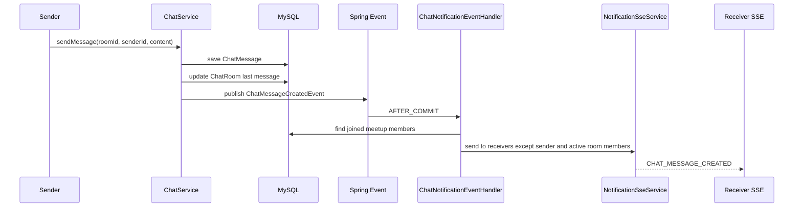

# 05 - SSE Notification

## Scope

This work unit adds the first user notification stream with SSE.

```text
GET /api/v1/notifications/subscribe
Header: X-Member-Id
Produces: text/event-stream
```

## Core Direction

WebSocket is used for users inside a chat room.

SSE is used for user-level notifications outside the chat room.

```text
Inside chat room:
- WebSocket
- /topic/chat/rooms/{roomId}
- Full message event

Outside chat room:
- SSE
- /api/v1/notifications/subscribe
- User-level notification event
```

## Message Notification Flow



## Active Room Presence

The server keeps a lightweight in-memory presence map for the first version.

```text
SEND /app/chat/rooms/{roomId}/enter
{
  "memberId": 2
}

SEND /app/chat/rooms/{roomId}/leave
{
  "memberId": 2
}
```

When a chat message is created, SSE notification is skipped for:

```text
1. the sender
2. members currently marked as inside the same chat room
```

Presence is indexed by WebSocket session id.

```text
sessionId -> [(roomId, memberId)]
roomId -> memberId -> session count
```

If the browser closes abruptly and the client cannot send `leave`, Spring raises `SessionDisconnectEvent`.

```text
SessionDisconnectEvent
  -> ChatWebSocketSessionEventHandler
  -> ChatRoomPresenceService.disconnect(sessionId)
  -> remove all room presence records for that session
```

## Why Spring Event First

Kafka is not required for the first version.

Spring application events keep chat and notification separated inside one application.

```text
Current:
- ChatService publishes ChatMessageCreatedEvent
- Notification handler consumes it after transaction commit
- SSE delivers only to connected users

Later:
- Replace or mirror this event with Kafka
- Store offline notifications in DB
- Cache unread count in Redis
```

## Current Limitation

Room presence is currently in-memory and tied to WebSocket session lifecycle.

```text
Not yet implemented:
- offline notification persistence
- Redis unread count cache
- Redis-backed active room presence for multi-server deployment
- multi-device notification policy
```

## Study Points

```text
1. SseEmitter lifecycle: completion, timeout, error cleanup
2. text/event-stream response format
3. Why SSE is one-way server-to-client
4. Why chat room messages use WebSocket and outside notifications use SSE
5. AFTER_COMMIT event handling and why notification should not fire before DB commit
6. Multi-session policy: one member can have multiple open SSE emitters
7. Future Redis role: online state, unread count, and multi-server event fan-out
8. Presence cleanup by SessionDisconnectEvent
```
