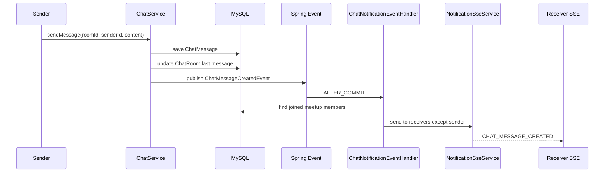

# 05 - SSE Notification

## Scope

This work unit adds the first user notification stream with SSE.

```text
GET /api/v1/notifications/subscribe
Header: X-Member-Id
Produces: text/event-stream
```

## Core Direction

WebSocket is used for users inside a chat room.

SSE is used for user-level notifications outside the chat room.

```text
Inside chat room:
- WebSocket
- /topic/chat/rooms/{roomId}
- Full message event

Outside chat room:
- SSE
- /api/v1/notifications/subscribe
- User-level notification event
```

## Message Notification Flow



## Why Spring Event First

Kafka is not required for the first version.

Spring application events keep chat and notification separated inside one application.

```text
Current:
- ChatService publishes ChatMessageCreatedEvent
- Notification handler consumes it after transaction commit
- SSE delivers only to connected users

Later:
- Replace or mirror this event with Kafka
- Store offline notifications in DB
- Cache unread count in Redis
```

## Current Limitation

The server does not yet know whether the receiver is currently looking at the same chat room.

So the first version sends SSE to connected receivers except the sender.

```text
Not yet implemented:
- active room presence
- offline notification persistence
- Redis unread count cache
- multi-device notification policy
```

## Study Points

```text
1. SseEmitter lifecycle: completion, timeout, error cleanup
2. text/event-stream response format
3. Why SSE is one-way server-to-client
4. Why chat room messages use WebSocket and outside notifications use SSE
5. AFTER_COMMIT event handling and why notification should not fire before DB commit
6. Multi-session policy: one member can have multiple open SSE emitters
7. Future Redis role: online state, unread count, and multi-server event fan-out
```
