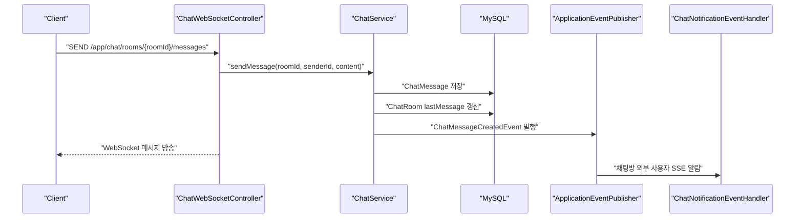
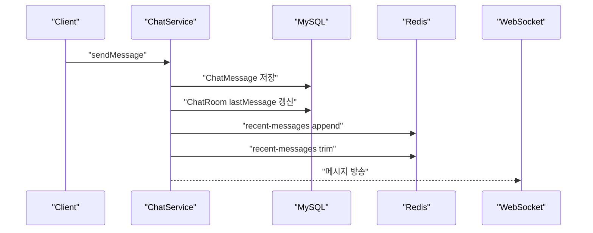
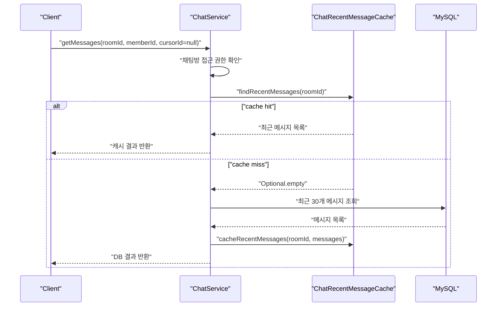
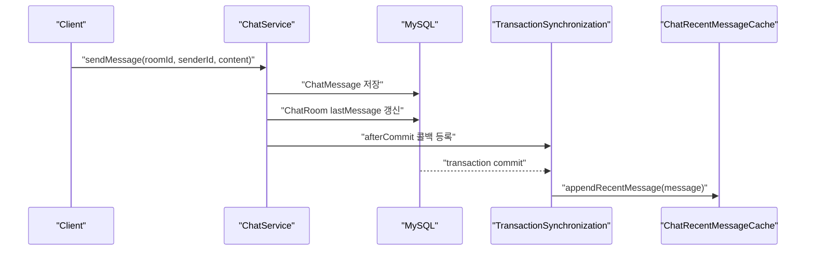

# 06 Redis Chat Performance Strategy

이 문서는 채팅 서버에 Redis를 붙일 때의 성능 개선 목표와 DB 정합성 전략을 정리한다.
현재 단계에서는 Redis를 메시지의 원장으로 사용하지 않는다.
메시지 원장은 MySQL이며, Redis는 빠른 조회와 카운트, presence 같은 휘발성 상태를 보조한다.

## 1. 먼저 정해야 하는 기준

채팅에서 가장 중요한 기준은 다음이다.

```text
DB
  - 반드시 잃으면 안 되는 데이터
  - 재처리와 복구의 기준이 되는 데이터
  - 메시지 본문, 메시지 생성 시각, 읽음 커서의 최종 상태

Redis
  - 빠르게 읽어야 하는 데이터
  - 다시 계산할 수 있는 데이터
  - 잠깐 틀려도 DB 기준으로 복구 가능한 데이터
  - 최근 메시지 캐시, 안 읽은 개수 캐시, 온라인/presence 상태
```

따라서 이번 작업의 핵심 원칙은 다음과 같다.

```text
MySQL is source of truth.
Redis is read optimization and ephemeral state.
```

## 2. 현재 채팅 흐름

현재 메시지 전송은 DB 저장을 먼저 수행한다.



이 구조는 정합성 측면에서 안전하다.
메시지 저장에 실패하면 WebSocket 방송도 성공으로 처리하지 않는 방향을 유지할 수 있기 때문이다.

## 3. Redis를 어디에 쓸 것인가

이번 Redis 성능 개선 후보는 네 가지다.

```text
1. 최근 메시지 캐시
   - 채팅방 입장 시 최근 30개 메시지를 빠르게 반환한다.
   - Redis List 또는 ZSet 후보.
   - DB 장애 복구 기준은 MySQL이다.

2. 안 읽은 메시지 수 캐시
   - 채팅방 목록에서 unread count를 빠르게 보여준다.
   - Redis Hash 또는 String 후보.
   - 틀어지면 read_state와 chat_room.last_message_id 기준으로 재계산한다.

3. 채팅방 presence
   - 현재 누가 채팅방 안에 있는지 판단한다.
   - 채팅방 내부 사용자는 WebSocket 메시지를 받으므로 SSE 알림에서 제외한다.
   - Redis Set + TTL 후보.

4. 메시지 중복 처리
   - 클라이언트 재전송이나 네트워크 재시도에 대비한다.
   - clientMessageId를 받아 Redis SETNX로 짧은 시간 중복을 막을 수 있다.
```

## 4. Redis를 바로 메시지 저장소로 쓰지 않는 이유

Redis에 먼저 쓰고 나중에 DB에 저장하는 방식은 성능상 좋아 보일 수 있다.
하지만 초기에 이 방식을 쓰면 정합성 문제가 커진다.

```text
Redis 먼저 저장
  - 장점: 응답이 빠르다.
  - 단점: DB 저장 실패 시 사용자는 본 메시지가 사라질 수 있다.
  - 단점: 서버 장애 시 Redis와 DB의 차이를 복구하는 정책이 필요하다.
  - 단점: 메시지 순서, 재시도, 중복 저장 처리가 복잡해진다.

DB 먼저 저장
  - 장점: 메시지 유실 가능성이 낮다.
  - 장점: 장애가 나도 DB 기준으로 복구할 수 있다.
  - 단점: DB 쓰기 성능이 병목이 될 수 있다.
```

현재 단계에서는 서비스 안정성과 학습 난이도를 고려해 DB 먼저 저장한다.
Redis는 DB 저장 이후 캐시를 갱신하는 방식으로 붙인다.

## 5. 추천 1차 적용 범위

첫 번째 Redis 작업 단위에서는 메시지 저장 경로를 크게 바꾸지 않는다.
대신 조회 비용을 줄이는 쪽부터 시작한다.

```text
1단계: 최근 메시지 캐시
  - 채팅방 입장 시 최근 메시지 조회를 Redis에서 먼저 시도한다.
  - 캐시가 없으면 MySQL에서 조회한 뒤 Redis에 적재한다.
  - 메시지 전송 성공 후 Redis 최근 메시지 캐시에도 append한다.

2단계: 안 읽은 메시지 수 캐시
  - 메시지 생성 시 채팅방 외부 멤버의 unread count를 증가시킨다.
  - 읽음 처리 시 해당 room/member unread count를 0으로 초기화한다.
  - 캐시 유실 시 DB 기준으로 재계산할 수 있게 한다.

3단계: Redis presence
  - 현재 메모리 기반 ChatRoomPresenceService를 Redis 기반 구현으로 교체할 수 있게 한다.
  - 단일 서버에서는 메모리도 가능하지만, 다중 서버에서는 Redis가 필요하다.
```

## 6. 최근 메시지 캐시 전략

최근 메시지는 채팅방 입장 시 자주 조회된다.
현재는 매번 MySQL에서 다음 쿼리를 수행한다.

```text
findTop30ByRoomIdOrderByIdDesc(roomId)
findTop30ByRoomIdAndIdLessThanOrderByIdDesc(roomId, cursorId)
```

Redis 적용 후에는 첫 페이지 조회만 캐시 대상으로 잡는다.

```text
대상
  - cursorId가 없는 첫 페이지
  - 최근 30개 메시지

비대상
  - cursorId가 있는 과거 메시지 조회
  - 오래된 메시지 페이지네이션
```

이렇게 제한하는 이유는 모든 페이지를 캐싱하면 무효화와 메모리 관리가 복잡해지기 때문이다.
채팅 서비스에서 가장 자주 발생하는 조회는 "방에 들어갈 때 최근 메시지를 가져오는 요청"이다.

예상 Redis key:

```text
chat:room:{roomId}:recent-messages
```

자료구조 후보:

```text
Redis List
  - RPUSH로 새 메시지 추가
  - LTRIM으로 최근 30~100개 유지
  - LRANGE로 조회

Redis ZSet
  - score를 messageId 또는 createdAt으로 둔다.
  - 범위 조회가 편하다.
  - List보다 구조는 조금 복잡하다.
```

현재 요구에는 Redis List가 충분하다.
메시지 순서는 DB의 auto increment id를 기준으로 맞춘다.

## 7. 최근 메시지 캐시 정합성

메시지 전송 시 순서는 다음을 추천한다.



Redis 갱신이 실패했을 때의 정책은 두 가지가 있다.

```text
정책 A: Redis 실패를 무시한다.
  - DB 저장은 성공했으므로 메시지는 유실되지 않는다.
  - 다음 조회에서 캐시가 오래될 수 있다.
  - 캐시 삭제 또는 TTL로 자연 복구한다.

정책 B: Redis 실패 시 캐시 key를 삭제한다.
  - 다음 조회가 DB에서 다시 캐시를 만든다.
  - 구현이 조금 더 명확하다.
```

초기 구현은 정책 B를 추천한다.
캐시를 잘못 유지하는 것보다, 삭제하고 DB에서 다시 채우는 편이 안전하다.

## 8. 안 읽은 메시지 수 전략

DB 기준 읽음 상태는 `chat_room_read_state.last_read_message_id`다.
Redis unread count는 화면 성능을 위한 보조 값으로 둔다.

예상 Redis key:

```text
chat:room:{roomId}:unread-counts
  - Hash
  - field: memberId
  - value: unreadCount
```

메시지 생성 시:

```text
1. 메시지 DB 저장
2. 채팅방 참여자 조회
3. 보낸 사람 제외
4. 현재 채팅방 안에 있는 사용자 제외
5. 나머지 사용자 unread count 증가
```

읽음 처리 시:

```text
1. DB read_state를 chat_room.last_message_id로 갱신
2. Redis unread count를 0으로 초기화
3. WebSocket read event 방송
```

중요한 점은 DB read cursor가 최종 기준이라는 것이다.
Redis count가 틀어지면 아래 방식으로 복구할 수 있다.

```sql
select count(*)
from chat_message
where room_id = :roomId
  and id > :lastReadMessageId;
```

## 9. 안 읽은 사람 수와 사용자별 읽음 위치

나중에 메시지별로 "몇 명이 안 읽었는지"를 보여주려면,
메시지마다 read row를 만들기보다 사용자별 read cursor를 유지하는 방식이 낫다.

```text
messageId = 100
room members = 10명
lastReadMessageId >= 100인 사람 = 7명
안 읽은 사람 수 = 10 - 7 = 3
```

이 방식은 메시지마다 읽음 데이터를 저장하지 않아도 된다.
다만 메시지별 안 읽은 사람 수를 자주 보여줘야 하면 계산 비용이 커질 수 있으므로,
나중에는 Redis Sorted Set을 검토할 수 있다.

예상 Redis key:

```text
chat:room:{roomId}:read-cursors
  - ZSet
  - member: memberId
  - score: lastReadMessageId
```

메시지별 읽은 사람 수:

```text
ZCOUNT chat:room:{roomId}:read-cursors {messageId} +inf
```

하지만 이 구조는 초기부터 넣지 않는다.
처음에는 DB의 `chat_room_read_state`를 기준으로 가고,
JMeter 테스트에서 병목이 확인되면 Redis read cursor 캐시를 추가한다.

## 10. Presence Redis 전환 전략

현재 presence는 서버 메모리 기반이다.
서버가 한 대일 때는 동작하지만, 서버가 여러 대면 각 서버가 서로의 메모리를 볼 수 없다.

Redis로 옮기면 다음 구조를 고려한다.

```text
chat:room:{roomId}:active-members
  - Set
  - 현재 방 안에 있는 memberId 목록

chat:session:{sessionId}
  - String 또는 Hash
  - sessionId가 어떤 roomId/memberId에 들어가 있는지 저장
  - TTL 적용

chat:member:{memberId}:sessions
  - Set
  - 같은 사용자의 다중 탭/다중 기기 세션 관리
```

disconnect가 정상적으로 들어오면 Redis에서 즉시 제거한다.
disconnect가 누락되면 TTL로 정리한다.

## 11. DB 정합성 원칙

이번 Redis 작업에서 지켜야 할 정합성 원칙은 다음이다.

```text
1. 메시지 본문은 MySQL에 먼저 저장한다.
2. Redis 캐시 실패 때문에 메시지 전송 전체를 실패시키지 않는다.
3. Redis에 있는 unread count는 화면용 값이다.
4. 최종 읽음 위치는 chat_room_read_state.last_read_message_id다.
5. 캐시가 없거나 의심스러우면 MySQL에서 다시 계산한다.
6. Redis key에는 TTL 또는 trim 정책을 둔다.
7. Redis 장애 시에도 기본 채팅 송수신은 DB + WebSocket으로 동작해야 한다.
```

## 12. 이번 작업 단위의 구현 후보

2시간 단위 작업으로는 아래 정도가 적당하다.

```text
1. Redis chat cache 포트 정의
   - ChatRecentMessageCache 같은 application port 또는 domain-facing interface 작성
   - ChatService가 RedisTemplate을 직접 알지 않게 한다.

2. Redis infrastructure 구현체 작성
   - RedisChatRecentMessageCache
   - Redis key 생성 책임 분리

3. 최근 메시지 첫 페이지 캐시 적용
   - cursorId == null일 때 Redis 조회
   - cache miss면 DB 조회 후 캐시 저장

4. 메시지 전송 성공 후 캐시 append
   - DB 저장 성공 이후 Redis 갱신
   - Redis 실패 시 key 삭제 또는 로그 처리

5. 테스트
   - 캐시 hit 시 DB 조회를 줄이는 단위 테스트
   - cache miss 시 DB fallback 테스트
   - Redis 장애 시 메시지 저장이 실패하지 않는 정책 테스트
```

## 13. 아직 하지 않을 것

초기 Redis 작업에서 아래는 미룬다.

```text
Kafka 기반 채팅 이벤트 처리
  - 아직 메시지 실시간 전송에는 필요하지 않다.

Redis Pub/Sub
  - 서버 여러 대에서 WebSocket 메시지를 서로 전파할 때 필요하다.
  - 단일 서버에서는 먼저 하지 않는다.

메시지 write-behind
  - Redis에 먼저 쓰고 DB에 나중에 저장하는 구조다.
  - 정합성 난이도가 올라가므로 지금은 하지 않는다.

전체 채팅 페이지 캐싱
  - 첫 페이지 최근 메시지부터 검증한다.
```

## 14. README에 기록할 성능 비교 항목

나중에 JMeter 또는 k6 결과를 README에 기록할 때는 다음 표를 채운다.

```text
대상 API
  - 채팅방 최근 메시지 조회
  - 채팅방 목록 조회
  - 읽음 처리

측정 지표
  - 평균 응답 시간
  - p95 latency
  - p99 latency
  - TPS 또는 RPS
  - error rate
  - MySQL query count
  - Redis hit ratio

비교
  - Redis 적용 전
  - Redis 최근 메시지 캐시 적용 후
  - Redis unread count 적용 후
```

## 15. 결론

Redis는 채팅 서버에서 강력하지만, 메시지 원장을 Redis로 옮기는 순간 정합성 난이도가 급격히 올라간다.
현재 프로젝트에서는 MySQL을 원장으로 유지하고 Redis는 성능 최적화 계층으로 사용한다.

이번 Redis 작업의 첫 목표는 "채팅방 입장 시 최근 메시지 조회 부하 줄이기"다.
그 다음 unread count, presence, Redis Pub/Sub 순서로 확장하는 것이 안정적이다.

## 16. 작업 단위 1: 최근 메시지 캐시 1차 적용

이번 작업에서는 채팅방 입장 시 가장 자주 발생하는 최근 메시지 조회를 Redis로 보조한다.

변경 파일:

```text
src/main/java/com/fitmeet/chat/application/ChatRecentMessageCache.java
  - ChatService가 Redis 기술을 직접 알지 않도록 만든 application port.

src/main/java/com/fitmeet/chat/infrastructure/RedisChatRecentMessageCache.java
  - StringRedisTemplate 기반 Redis 구현체.
  - Redis List에 최근 메시지를 JSON 문자열로 저장한다.

src/main/java/com/fitmeet/chat/application/ChatService.java
  - cursorId가 없는 첫 페이지 조회만 캐시를 먼저 확인한다.
  - cache miss면 MySQL에서 조회한 뒤 Redis에 저장한다.
  - 메시지 저장 성공 후 트랜잭션 commit 이후에 Redis recent message cache를 append한다.

src/test/java/com/fitmeet/chat/application/ChatServiceTest.java
  - cache hit이면 DB 메시지 조회를 하지 않는지 검증한다.
  - cache miss이면 DB 조회 후 cache 저장을 호출하는지 검증한다.
  - 메시지 전송 후 recent message cache append를 호출하는지 검증한다.
```

## 17. 이번 구현 흐름



메시지 전송 시 캐시 갱신은 DB commit 이후로 미룬다.



이렇게 한 이유는 트랜잭션이 롤백됐는데 Redis에만 메시지가 남는 상황을 막기 위해서다.

## 18. 공부해야 할 부분

이번 작업에서 꼭 보면 좋은 부분은 다음이다.

```text
1. Cache Aside Pattern
   - 먼저 캐시를 조회한다.
   - 없으면 DB에서 조회한다.
   - DB 결과를 다시 캐시에 채운다.

2. Redis List
   - rightPushAll: 여러 메시지를 오른쪽에 추가한다.
   - rightPush: 새 메시지를 오른쪽에 추가한다.
   - trim: 최근 N개만 남기고 자른다.
   - range: 저장된 메시지 범위를 조회한다.

3. TTL
   - 캐시가 영원히 남지 않게 만료 시간을 둔다.
   - 현재 최근 메시지 캐시는 6시간 TTL을 사용한다.

4. TransactionSynchronization
   - DB 트랜잭션이 commit된 이후에 특정 작업을 실행할 수 있다.
   - Redis 캐시 갱신처럼 DB 정합성과 관련 있는 후속 처리에 유용하다.

5. DDD 계층 분리
   - ChatService는 ChatRecentMessageCache 인터페이스만 안다.
   - RedisTemplate은 infrastructure 구현체 안에만 있다.
```

## 19. 네가 결정해야 할 부분

아래 항목은 정답이 하나라기보다 서비스 성격에 맞춰 결정해야 한다.

```text
1. 최근 메시지 캐시 개수
   - 현재 구현 기준: 30개
   - 선택지: 30개, 50개, 100개
   - 채팅방 입장 UX와 Redis 메모리 사용량의 균형을 정해야 한다.

2. 최근 메시지 TTL
   - 현재 구현 기준: 6시간
   - 선택지: 1시간, 6시간, 24시간
   - 채팅방 재방문 빈도가 높으면 길게, 메모리 절약이 중요하면 짧게 잡는다.

3. Redis 캐시 실패 정책
   - 현재 구현 기준: 캐시 실패 시 DB 흐름은 살리고 해당 key 삭제를 시도한다.
   - 선택지: 실패 무시, key 삭제, 장애 메트릭 기록 후 fallback
   - 실서비스라면 실패율 모니터링이 필요하다.

4. 캐시 대상 범위
   - 현재 구현 기준: cursorId가 없는 첫 페이지 조회만 캐시한다.
   - 선택지: 첫 페이지만 캐시, 최근 몇 페이지 캐시, 전체 페이지 캐시
   - 초기 서비스는 첫 페이지만 캐시하는 쪽이 정합성과 구현 난이도 면에서 좋다.

5. 메시지 생성 후 캐시 append 시점
   - 현재 구현 기준: DB commit 이후
   - 다른 선택지: 트랜잭션 내부에서 즉시 append
   - 정합성을 우선하면 commit 이후가 맞다.
```

현재 추천은 다음이다.

```text
최근 메시지 캐시 개수: 30개
TTL: 6시간
캐시 실패 정책: DB 정상 흐름 유지 + 캐시 key 삭제
캐시 대상: 첫 페이지
append 시점: DB commit 이후
```

## 20. 검증 기록

```text
compileJava
  - clean compileJava 성공

test
  - compileTestJava에서 main class output을 classpath에 포함하고도 javac가 main class를 해석하지 못하는 문제가 있었다.
  - compileTestJava에 main source를 함께 제공하도록 build.gradle을 보정했다.
  - 최종적으로 ./gradlew.bat --no-daemon test 성공을 확인했다.
  - 상세 원인은 docs/troubleshooting/02-gradle-javac-windows-sandbox.md에 정리했다.
```
