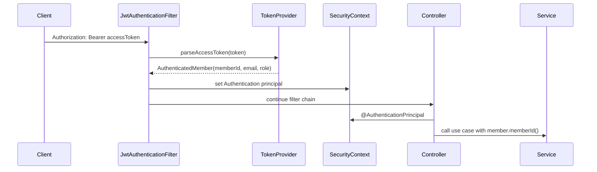

# 07 - JWT Authentication Flow

## Scope

This work unit changes REST and SSE APIs from the temporary `X-Member-Id` header to JWT authentication.

WebSocket message payload authentication is intentionally left for a later work unit because STOMP authentication usually belongs in the CONNECT frame and `ChannelInterceptor`.

## Request Flow



## Class Roles

```text
SecurityConfig
- declares stateless Spring Security
- opens /api/v1/auth/** and /ws/**
- protects every other HTTP request
- registers JwtAuthenticationFilter

JwtAuthenticationFilter
- reads Authorization header
- verifies Bearer token format
- asks TokenProvider to parse and validate the JWT
- stores AuthenticatedMember in SecurityContext

JwtTokenProvider
- creates access tokens after login
- validates token signature and expiration
- converts JWT claims into AuthenticatedMember

AuthenticatedMember
- small auth principal record
- carries memberId, email, and role
- prevents controllers from trusting a client-supplied member id
```

## Why Controllers Changed

Before:

```java
@RequestHeader("X-Member-Id") Long memberId
```

This was useful for early local development but insecure because the client could pretend to be another member.

After:

```java
@AuthenticationPrincipal AuthenticatedMember member
```

Now the member id comes from a token that the server signed during login.

## DDD Boundary Note

Authentication remains a common application concern, not a meetup or chat domain rule.

The presentation layer extracts the authenticated member id and passes only the id into application services.

```text
presentation: JWT principal -> memberId
application: use-case orchestration
domain: business rules using ids
infrastructure: token signing/parsing implementation
```

## Current Limitations

```text
1. Refresh token is not implemented yet.
2. Token blacklist/logout is not implemented yet.
3. WebSocket STOMP CONNECT authentication is not implemented yet.
4. JWT is manually implemented for study purposes; a library such as JJWT or Nimbus JOSE can replace it later.
```
