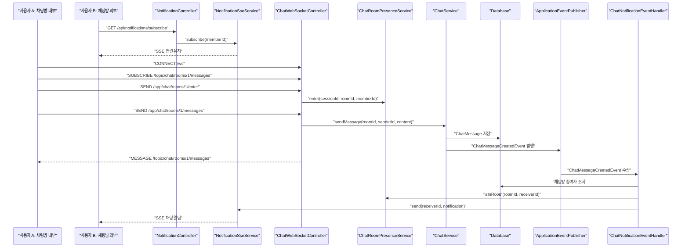
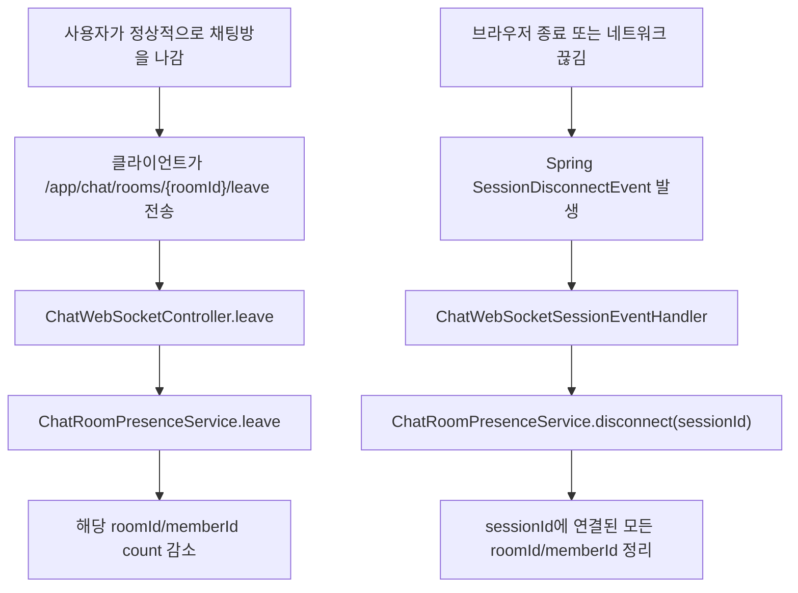
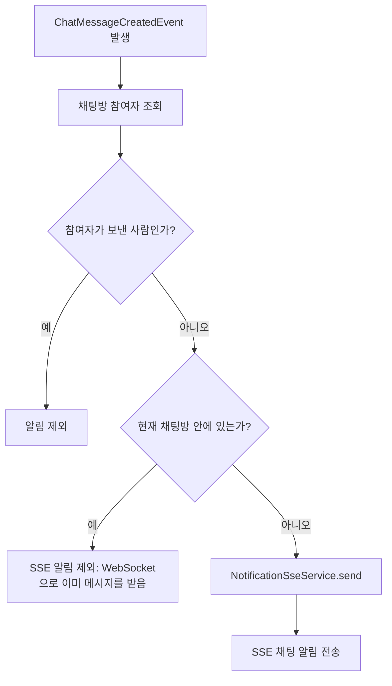

# Socket Study

이 문서는 Do Challenge 채팅 서버를 공부하기 위한 정리 문서다.
현재 목표는 "채팅방 안에서는 WebSocket", "채팅방 밖에서는 SSE 알림"으로 역할을 나누고,
사용자가 채팅방 안에 있는지 판단하는 presence 구조를 이해하는 것이다.

## 1. 전체 역할 분리

현재 실시간 기능은 크게 세 부분으로 나뉜다.

```text
ChatWebSocketController
  - 클라이언트가 WebSocket으로 직접 보낸 요청을 처리한다.
  - 메시지 전송, 읽음 처리, 채팅방 입장, 채팅방 퇴장을 담당한다.

ChatWebSocketSessionEventHandler
  - 클라이언트가 직접 호출하는 컨트롤러가 아니다.
  - 브라우저 종료, 새로고침, 네트워크 끊김처럼 WebSocket 연결이 끊어졌을 때
    Spring이 발생시키는 SessionDisconnectEvent를 처리한다.

NotificationController
  - 채팅방 밖에 있는 사용자가 SSE 연결을 여는 HTTP 컨트롤러다.
  - 서버가 사용자에게 실시간 알림을 내려보낼 통로를 만든다.
```

즉, WebSocket Controller는 사용자의 명시적인 행동을 처리하고,
Session Event Handler는 연결 생명주기에서 발생하는 서버 내부 이벤트를 처리한다.

## 2. WebSocket 설정 핵심

```java
public void configureMessageBroker(MessageBrokerRegistry registry) {
    registry.setApplicationDestinationPrefixes("/app");
    registry.enableSimpleBroker("/topic");
}
```

이 설정은 클라이언트가 보내는 주소와 서버가 방송하는 주소를 분리한다.

```text
/app
  - 클라이언트 -> 서버
  - @MessageMapping 메서드로 들어온다.
  - 예: /app/chat/rooms/1/messages

/topic
  - 서버 -> 구독 중인 클라이언트
  - messagingTemplate.convertAndSend(...)로 방송한다.
  - 예: /topic/chat/rooms/1/messages
```

클라이언트는 보통 채팅방에 들어오면 먼저 `/topic/chat/rooms/{roomId}/messages`를 구독하고,
메시지를 보낼 때는 `/app/chat/rooms/{roomId}/messages`로 전송한다.

## 3. 클라이언트 구독부터 알림까지의 흐름



핵심은 메시지 자체는 WebSocket으로 채팅방 구독자에게 전달하고,
채팅방 밖에 있는 사용자에게만 SSE 알림을 보낸다는 점이다.

## 4. 메시지 전송과 읽음 처리는 요청이 두 번인가?

보통은 두 요청이 분리된다.

```text
1. 메시지 전송
   - 사용자가 메시지를 입력하고 보낸다.
   - /app/chat/rooms/{roomId}/messages

2. 읽음 처리
   - 사용자가 채팅방에 들어왔거나, 화면에 메시지가 실제로 보였을 때 처리한다.
   - /app/chat/rooms/{roomId}/read
```

두 기능을 무조건 하나로 합치면 편해 보이지만,
메시지를 보낸 사람과 읽는 사람이 다르고, 사용자가 채팅방 목록에서 읽음 처리만 할 수도 있기 때문에
실무에서는 별도 유스케이스로 두는 편이 자연스럽다.

다만 사용자가 채팅방에 들어와 있는 상태에서 새 메시지를 받으면,
프론트엔드가 일정 조건에 따라 자동으로 read 이벤트를 보내는 방식으로 UX를 단순하게 만들 수 있다.

## 5. 채팅방 목록에서 바로 읽음 처리

카카오톡처럼 채팅방 목록에서 바로 읽음 처리를 지원하려면 HTTP API로도 읽음 처리를 열어둘 수 있다.

```text
채팅방 목록 화면
  -> 사용자가 특정 채팅방을 읽음 처리
  -> HTTP PATCH /api/chat/rooms/{roomId}/read
  -> ChatService.markAsRead(...)
  -> WebSocket으로 /topic/chat/rooms/{roomId}/reads 이벤트 방송
```

이때 WebSocket 방송을 하는 이유는 같은 채팅방에 들어와 있는 다른 사용자의 UI도 즉시 갱신하기 위해서다.
예를 들어 "상대가 어디까지 읽었는지"를 표시하는 UI를 붙이면 read cursor 변경을 실시간으로 알아야 한다.

## 6. Presence가 필요한 이유

presence는 "지금 이 사용자가 이 채팅방 안에 있는가?"를 판단하기 위한 서버 상태다.

이 값이 필요한 이유는 채팅 메시지가 생성됐을 때 알림 대상을 나누기 위해서다.

```text
메시지 생성
  -> 보낸 사람 제외
  -> 현재 채팅방 안에 있는 사람 제외
  -> 나머지 참여자에게 SSE 알림 전송
```

채팅방 안에 이미 있는 사용자에게 SSE 알림까지 보내면 같은 메시지를 중복으로 경험하게 된다.
그래서 WebSocket으로 메시지를 받는 사용자와 SSE 알림을 받는 사용자를 분리한다.

## 7. 현재 Presence 자료구조

현재 구현은 두 자료구조를 같이 사용한다.

```text
sessionPresences
  - key: WebSocket sessionId
  - value: 이 세션이 들어가 있는 채팅방 목록
  - 목적: 연결이 갑자기 끊겼을 때 해당 세션의 presence를 한 번에 정리한다.

roomMemberCounts
  - key: roomId
  - value: memberId별 접속 세션 수
  - 목적: 특정 사용자가 특정 채팅방 안에 있는지 빠르게 확인한다.
```

형태로 보면 다음과 같다.

```text
sessionPresences
  "session-a" -> [(roomId=1, memberId=10)]
  "session-b" -> [(roomId=1, memberId=10)]
  "session-c" -> [(roomId=1, memberId=20)]

roomMemberCounts
  roomId=1
    memberId=10 -> 2
    memberId=20 -> 1
```

여기서 memberId 10의 count가 2인 이유는 같은 사용자가 브라우저 탭 2개나 기기 2개로 같은 방에 들어올 수 있기 때문이다.
하나의 세션이 끊겨도 다른 세션이 남아 있으면 그 사용자는 여전히 채팅방 안에 있다고 봐야 한다.

## 8. sessionPresences만으로 충분하지 않은가?

현재 규모에서는 `sessionPresences`만으로도 구현할 수 있다.
다만 그 경우 `isInRoom(roomId, memberId)`를 확인할 때 전체 세션을 순회해야 한다.

```text
sessionPresences만 사용하는 경우
  - 장점: 구조가 단순하다.
  - 단점: 알림 보낼 때마다 전체 세션을 훑어야 한다.

roomMemberCounts도 같이 사용하는 경우
  - 장점: 특정 roomId/memberId가 현재 방 안에 있는지 빠르게 확인할 수 있다.
  - 단점: enter, leave, disconnect에서 두 자료구조의 정합성을 맞춰야 한다.
```

지금 프로젝트는 공부용이면서 동시에 서비스화를 목표로 하므로,
현재 코드는 "다중 탭, 다중 기기, 알림 제외 판단"까지 고려한 형태다.
하지만 JMeter 테스트 전에는 과한 느낌이 들 수 있으므로,
원하면 이후 작업에서 `sessionPresences` 단일 구조로 단순화한 뒤 성능 테스트 결과를 보고 다시 늘릴 수 있다.

## 9. computeIfAbsent 이해

presence 등록 코드에서 자주 보이는 형태는 다음과 같다.

```java
sessionPresences
    .computeIfAbsent(sessionId, ignored -> ConcurrentHashMap.newKeySet())
    .add(new PresenceKey(roomId, memberId));
```

이 코드는 말로 풀면 다음과 같다.

```text
1. sessionPresences에서 sessionId에 해당하는 Set을 찾는다.
2. 없으면 ConcurrentHashMap.newKeySet()으로 새 Set을 만든다.
3. 그 Set을 sessionPresences에 저장한다.
4. 반환된 Set에 PresenceKey(roomId, memberId)를 추가한다.
```

풀어쓴 코드는 대략 이렇게 볼 수 있다.

```java
Set<PresenceKey> presences = sessionPresences.get(sessionId);

if (presences == null) {
    presences = ConcurrentHashMap.newKeySet();
    sessionPresences.put(sessionId, presences);
}

presences.add(new PresenceKey(roomId, memberId));
```

`computeIfAbsent`를 쓰는 이유는 동시성 환경에서 "없으면 만들고 넣는다"는 동작을 안전하고 짧게 표현할 수 있기 때문이다.
채팅 서버는 여러 사용자의 enter, leave, disconnect 이벤트가 동시에 들어올 수 있으므로 일반 `HashMap`보다 동시성 컬렉션을 사용하는 편이 안전하다.

## 10. new HashSet<>(presences)를 쓰는 이유

disconnect 처리에서는 이런 형태가 나온다.

```java
for (PresenceKey presence : new HashSet<>(presences)) {
    decrease(presence.roomId(), presence.memberId());
}
```

`new HashSet<>(presences)`는 현재 presences의 복사본을 만드는 코드다.

이렇게 하는 이유는 순회 중 원본 Set이 변경될 수 있기 때문이다.
예를 들어 disconnect 정리 중에 leave가 동시에 들어오거나,
정리 로직 안에서 관련 값이 제거될 수 있다.
원본 컬렉션을 직접 순회하면서 동시에 수정하면 예외가 나거나 일부 값이 예상과 다르게 처리될 수 있다.

복사본을 순회하면 다음처럼 생각할 수 있다.

```text
1. disconnect 시점에 이 세션이 들어가 있던 방 목록을 사진처럼 찍어둔다.
2. 그 복사본을 기준으로 하나씩 count를 줄인다.
3. 원본 자료구조는 이미 sessionPresences.remove(sessionId)로 제거되어도 순회에는 영향이 없다.
```

즉, `new HashSet<>(presences)`는 "안전하게 정리하기 위한 스냅샷"에 가깝다.

## 11. leave와 disconnect 차이

```text
leave
  - 사용자가 정상적으로 채팅방을 나갈 때 클라이언트가 보낸다.
  - 예: 다른 화면으로 이동, 채팅방 닫기
  - ChatWebSocketController.leave(...)에서 처리한다.

disconnect
  - WebSocket 연결 자체가 끊겼을 때 서버가 감지한다.
  - 예: 브라우저 강제 종료, 새로고침, 네트워크 끊김, 앱 종료
  - ChatWebSocketSessionEventHandler가 SessionDisconnectEvent를 받아 처리한다.
```

브라우저가 갑자기 닫히면 클라이언트가 `/leave`를 보내지 못할 수 있다.
그래서 `disconnect` 기반 정리는 반드시 필요하다.



## 12. 알림 제외 판단 흐름



이 구조 덕분에 채팅방 내부 사용자는 WebSocket 메시지만 받고,
채팅방 외부 사용자는 SSE 알림을 받는다.

## 13. 지금 구조의 한계와 다음 개선 포인트

현재 presence는 서버 메모리에 저장된다.
서버가 한 대일 때는 괜찮지만, 서버가 여러 대가 되면 문제가 생긴다.

```text
서버 A
  - 사용자 10이 room 1에 들어와 있음

서버 B
  - 메시지 이벤트를 처리함
  - 서버 A의 메모리를 모르기 때문에 사용자 10이 방 안에 있는지 판단할 수 없음
```

서버를 여러 대로 늘릴 때는 Redis로 presence를 옮기는 것이 자연스럽다.

```text
Redis presence 예시
  room:1:members -> memberId set
  member:10:sessions -> sessionId set
  session:abc -> roomId/memberId info, TTL 포함
```

이때 Redis TTL이나 heartbeat를 같이 고려해야 한다.
네트워크 장애로 disconnect 이벤트가 누락되어도 TTL이 만료되면 presence가 자동으로 정리되게 만들 수 있기 때문이다.

## 14. 공부할 때 확인할 코드

```text
WebSocket 설정
  - src/main/java/com/fitmeet/common/config/WebSocketConfig.java

WebSocket 요청 처리
  - src/main/java/com/fitmeet/chat/presentation/websocket/ChatWebSocketController.java

WebSocket 연결 종료 이벤트 처리
  - src/main/java/com/fitmeet/chat/presentation/websocket/ChatWebSocketSessionEventHandler.java

Presence 상태 관리
  - src/main/java/com/fitmeet/chat/application/ChatRoomPresenceService.java

채팅 메시지 생성 이벤트 발행
  - src/main/java/com/fitmeet/chat/application/ChatService.java

채팅방 외부 사용자 SSE 알림 처리
  - src/main/java/com/fitmeet/notification/application/ChatNotificationEventHandler.java

SSE 연결 관리
  - src/main/java/com/fitmeet/notification/application/NotificationSseService.java
  - src/main/java/com/fitmeet/notification/presentation/NotificationController.java
```

## 15. 현재 설계 판단

현재 단계에서는 다음 기준으로 가져간다.

```text
채팅방 내부 실시간 메시지
  - WebSocket

채팅방 내부 읽음 이벤트
  - WebSocket

채팅방 외부 채팅 알림
  - SSE

presence 저장
  - 현재는 서버 메모리
  - 다중 서버 전환 시 Redis로 이동

Kafka
  - 현재 채팅 실시간 전송에는 사용하지 않는다.
  - 추후 통계, 검색 색인, 활동 로그, 알림 저장 같은 후속 비동기 처리에 사용한다.
```

핵심은 "실시간 메시지 전송 통로"와 "후속 처리 이벤트 버스"를 섞지 않는 것이다.
지금 단계에서는 WebSocket과 SSE만으로 채팅 UX를 먼저 완성하고,
Redis와 Kafka는 실제 병목과 확장 지점이 보일 때 붙이는 쪽이 더 학습하기 좋다.
