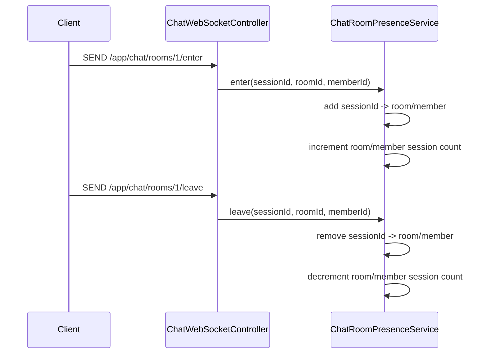
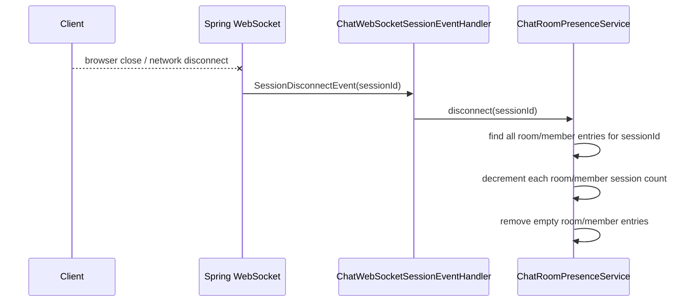
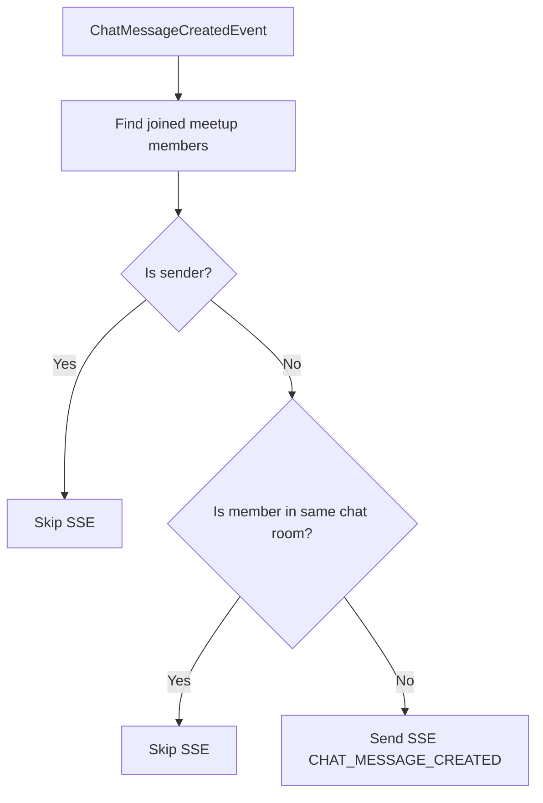

# 01 - Chat Room Presence Cleanup

## Problem

Chat notification delivery depends on knowing whether a member is currently inside a chat room.

The first idea was simple:

```text
enter room -> mark member as inside room
leave room -> remove member from room
```

But this has a failure case.

```text
Browser closes
Network disconnects
Mobile app is killed
Laptop sleeps
```

In those cases, the client may not send `leave`.

If the server keeps the member marked as inside the room, SSE notification can be skipped incorrectly.

## Impact

SSE notification is sent only to users outside the active chat room.

```text
Expected:
- member is no longer in chat room
- member should receive SSE notification

Failure:
- stale presence remains
- server thinks member is still in chat room
- SSE notification is skipped
```

This is a serious correctness issue for unread notification delivery.

## Current Structure

```mermaid
flowchart TD
    Client["Browser or App"] -->|SEND /app/chat/rooms/{roomId}/enter| WS["ChatWebSocketController"]
    WS --> Presence["ChatRoomPresenceService"]
    Presence --> SessionMap["sessionId -> roomId/memberId set"]
    Presence --> RoomMap["roomId -> memberId -> session count"]

    Client -->|SEND /app/chat/rooms/{roomId}/leave| WS
    WS --> Presence

    Client -. "abrupt disconnect" .-> Disconnect["SessionDisconnectEvent"]
    Disconnect --> Handler["ChatWebSocketSessionEventHandler"]
    Handler --> Presence
    Presence --> Cleanup["remove all presence entries for sessionId"]
```

## Data Structure

The service keeps two indexes.

```text
sessionPresences
sessionId -> Set<PresenceKey(roomId, memberId)>

roomMemberCounts
roomId -> memberId -> active session count
```

Why both are needed:

```text
roomMemberCounts:
- fast check for "is member currently in this room?"
- used before sending SSE notification

sessionPresences:
- cleanup by WebSocket session id
- required when browser closes without leave
```

## Normal Flow



## Abrupt Disconnect Flow



## Notification Decision Flow



## Why This Matters

Without session-based cleanup, presence state can become stale.

That makes notification behavior wrong:

```text
wrong presence -> wrong SSE skip -> missed notification
```

With `SessionDisconnectEvent`, the server can clean presence even when the client fails to send `leave`.

## Current Limitation

This implementation is correct for a single Spring Boot server.

It is not enough for multi-server deployment.

```text
Server A:
- WebSocket session connected
- presence stored in memory

Server B:
- chat message processed
- cannot see Server A memory
```

For multiple servers, presence should move to Redis.

```text
Redis key example:
chat:room:{roomId}:members
chat:session:{sessionId}:presence
```

## Study Points

```text
1. WebSocket session lifecycle
2. SessionDisconnectEvent timing
3. Why leave event alone is not reliable
4. Why sessionId is needed for cleanup
5. Why memberId alone is not enough with multi-tab usage
6. Why Redis is needed for multi-server presence
```
